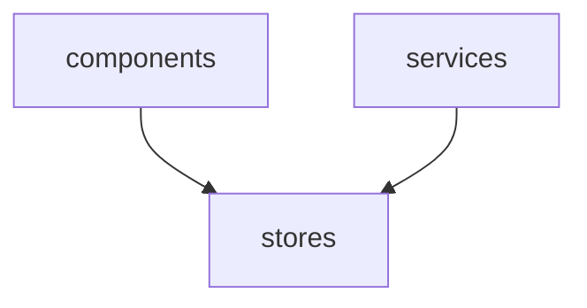
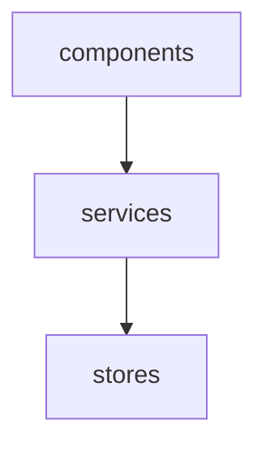
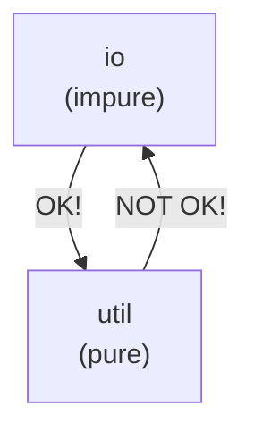
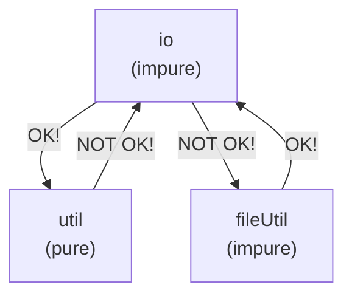

# Module Composer

A tiny but powerful closure-based module composition utility.

Why is it so common for JavaScript applications these days (backend _and_ frontend) to be organised and reasoned about in terms of scripts and files, and navigated via a convoluted maze of file imports?

Module Composer aims to encourage good modular design and intentionality for application architecture by making it easier to design and reason about applications at a higher level, in this case, as a composition of _modules_.

So what is a module? Not to be confused with JavaScript CJS or ESM modules, a module in this context is simply a plain old JavaScript object (a POJO!) with functions that accept a very explicitly defined set of _other_ modules. These functions are _higher-order_ in that they return another function whose invocation may be deferred to later in the application lifecycle, while retaining access to the provided modules thanks to the power of closures (stateful functions). Closures are a native feature of JavaScript.

If that sounds like a lot to wrap your head around, fear not! Implementation-wise it's actually rather simple. See the [basic example](#basic-example) below to see it in action.

## Table of Contents

<!-- START doctoc generated TOC please keep comment here to allow auto update -->
<!-- DON'T EDIT THIS SECTION, INSTEAD RE-RUN doctoc TO UPDATE -->
<!-- END doctoc generated TOC please keep comment here to allow auto update -->

## Install

```
npm install module-composer
```

## Basic example

Consider the following example:

<%- await readCode('./examples/basic/compose-no-export.js') %>

`modules` is simply an object containing an entry for each module:

```js
{
    stores: { ... },
    services: { ... },
    components: { ... }
}
```

The first step is to create a `compose` function for the given _uncomposed_ modules. The `compose` function is then used to compose a module of other modules. The _composed_ module is then returned and may be used to compose another module, and so on.

Each module is simply an object containing an entry for each function of the module:

<%- await readCode('./examples/basic/modules.js') %>

Notice the _double arrow_ functions? That's syntactic sugar for _a function that returns another function_.

Here's the equivalent _without_ double arrows, using `components` as an example:

```js
export default {
    components: {
        productDetails: ({ services }) => {
            return ({ product }) => { ... }
        }
    }
}
```

The `compose` function invokes the first arrow function with the specified modules for each entry in the module and returns the second arrow function.

This is analogous to calling a class constructor with dependencies and returning the resulting instance. However rather than using a class to encapsulate dependency state, closures (stateful functions) are used instead.

## Composition root

Module Composer should be isolated to the _composition root_ of the application.

> A Composition Root is a (preferably) unique location in an application where modules are composed together.<br/>[Mark Seeman](https://blog.ploeh.dk/2011/07/28/CompositionRoot/)

Module composition should occur as close to the entry point of the application as possible.

Here's an example of a composition root isolated to a separate file named `compose.js`: 

<%- await readCode('./examples/basic/compose.js') %>

And here's an example of an entry point for a single-page (web) application (SPA):

<%- await readCode('./examples/basic/app.js') %>

Recommended reading:

- [Composition Root](https://blog.ploeh.dk/2011/07/28/CompositionRoot/) by Mark Seemann.
- [Understanding the Composition Root](https://freecontent.manning.com/dependency-injection-in-net-2nd-edition-understanding-the-composition-root/) by Steven van Deursen & Mark Seemann.

## File system

Module Composer influences (but does not necessitate) the file system toward _file-per-function_.

The module hierarchy can be easily represented by the file system:

```
src/
    app.js
    compose.js
    modules/
        index.js
        stores/
            index.js
            add-to-cart.js        
        services/
            index.js
            order-product.js        
        components/
            index.js
            product-details.js
```

This hierarchy can be mirrored in code by rolling up each file in each directory using `index.js` files. This approach leads to a design where any file is only ever imported once regardless of the number of usages. It also reduces or eliminates the large blocks of import statements typically found at the top of each file, and eliminates any need for path backtracking, i.e. `../../../`. Path backtracking is a potential code smell due to the risk of inappropriate coupling. Instead, the relationships between each module are explicitly established during at application initialisation time.

<%- await readCode('./examples/basic/modules/index.js') %>

<%- await readCode('./examples/basic/modules/components/index.js') %>

This pattern opens the possibility of generating `index.js` files. This means that not only is each file only ever imported once, a developer needn't write import statements at all.

The package `module-indexgen` is designed to do just that: https://github.com/mattriley/node-module-indexgen

## Mermaid diagrams

Module Composer can generate diagrams-as-code using _Mermaid_.

> Mermaid is a tool for creating diagrams and visualizations using text and code.<br/> https://mermaid-js.github.io • https://github.com/mermaid-js/mermaid

GitHub can render diagrams directly from Mermaid syntax in markdown files. See [Include diagrams in your Markdown files with Mermaid](https://github.blog/2022-02-14-include-diagrams-markdown-files-mermaid/) for more information.

Use `compose.mermaid` to generate a Mermaid diagram:

<%- await readCode('./examples/basic/compose-mermaid.js') %>

Output:

```
graph TD;
    components-->services;
    services-->stores;
```

Which renders:

<%- await moduleGraph('./examples/basic/compose.js') %>

_If the diagram is not rendered, you might not be viewing this file in GitHub._

For a less contrived example, see [Advanced example: Agile Avatars](#advanced-example-agile-avatars) below.

## Dependency injection

Module Composer achieves the equivalent of _dependency injection_ using closures (stateful functions).

Well known advantages of dependency injection include:

- Ability to swap implementations, e.g. repositories that integrate with different database engines.
- Ability to stub/mock/fake dependencies for testing purposes.

Dependency injection is a big (and sometimes controversial) topic and worth being familiar with.

Although Module Composer enables dependency injection, remember that the primary aim is to encourage good modular design and intentionality for application architecture.

Recommended reading:

- [DIP in the Wild](https://martinfowler.com/articles/dipInTheWild.html) by Brett L. Schuchert on martinfowler.com
- [Inversion of Control Containers and the Dependency Injection pattern](https://martinfowler.com/articles/injection.html) by Martin Fowler
- [Partial application is dependency injection](https://blog.ploeh.dk/2017/01/30/partial-application-is-dependency-injection/) by Mark Seemann

## Functional programming

Module Composer is designed with a bias toward _functional programming_.

The closure-based approach is only possible thanks to JavaScript support for functions as first-class objects. That's not to suggest JavaScript or Module Composer are necessarily functional, but preferencing functions over classes (for instance) may encourage a more functional design. It's entirely possible, and arguably desirable to design JavaScript applications without classes!

An important consideration in functional design is the segregation of pure and impure functions. When designing modules, be intentional about purity and impurity.

Recommended reading:

- [Pure-Impure Segregation Principle](https://tyrrrz.me/blog/pure-impure-segregation-principle) by Oleksii Holub

## Application configuration

For convenience, config can be passed as an option to the composer function. If `configs` is an array, they will be merged using [Lodash merge](https://lodash.com/docs#merge) and returned along with the compose function.

In the next example, `defaultConfig`, `testConfig` and `userConfig` are merged to produce `config`, which is then passed as a dependency of the `components` module.

```js
const { compose, config } = composer(modules, { defaultConfig, configs: [testConfig, userConfig] });
const { components } = compose('components', { config });
```

This can be especially useful during testing by applying test config.

## Fitness functions

Module Composer can describe the dependency graph to enable _fitness functions_ on coupling.

> An architectural fitness function, as defined in Building Evolutionary Architectures, provides an objective integrity assessment of some architectural characteristics, which may encompass existing verification criteria, such as unit testing, metrics, monitors, and so on.<br/>[Thoughtworks](https://www.thoughtworks.com/en-au/radar/techniques/architectural-fitness-function)

Inappropriate coupling leads to brittle designs that can be difficult to reason about, difficult to change and difficult to test.

### Example 1

Here's an example fitness function in the form of a unit test that asserts the view layer is not directly coupled to the persistance layer. The `compose` function here refers to the composition root.

```js
test('components are not directly coupled to stores', t => {
    const { dependencies } = compose();
    t.notOk(dependencies['components'].includes('stores'));
});
```

`dependencies` is an object that lists the dependencies for each module:

```js
{
    components: ['services'],
    services: ['stores'],
    stores: []
}
```

The following design couples components to stores and should therefore fail the fitness function:



While this design should pass:



### Example 2

`util` is a module of _pure_ utility functions, and `io` is module is _impure_ io operations. It could be tempting to extend `util` with say file utilities that depend on `io`, however doing so would make `util` impure.



The following fitness function asserts that `util` is not coupled to `io`.

```js
test('util is not coupled to io in order to maintain purity', t => {
    const { dependencies } = compose();
    t.notOk(dependencies['util'].includes('io'));
});
```

The solution introducing file utilities whilst maintaining purity would be to introduce a new module, say `fileUtil`:



## Advanced example: Agile Avatars

> Great looking avatars for your agile board and experiment in FRAMEWORK-LESS, vanilla JavaScript.<br/>
https://agileavatars.com • https://github.com/mattriley/agileavatars

Module composition:

<%- await readCode(['../agileavatars', './src/compose.js']) %>

Mermaid digram:

<%- await moduleGraph('../agileavatars/src/compose.js') %>
