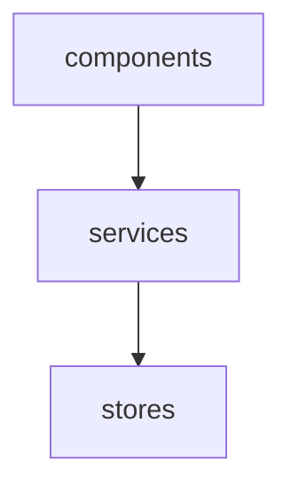

<%- lib.renderOpening() %>

## Install

<%- await lib.renderCode('npm install module-composer', 'sh', 'https://www.npmjs.com/package/module-composer') %>

## Background

Why is it so common for JavaScript applications these days (backend _and_ frontend) to be organised and reasoned about in terms of scripts and files, and navigated via a convoluted maze of file imports?

Module Composer aims to encourage good modular design and intentionality for application architecture by making it easier to design and reason about applications at a higher level, in this case, as a composition of _modules_.

So what is a module? Not to be confused with JavaScript CJS or ESM modules, a module in this context is simply a plain old JavaScript object (a POJO!) containing _higher-order_ functions that accept module dependencies as arguments. These higher-order functions in turn, return first-order functions enabling invocation to be deferred to later in the application lifecycle. Module dependencies remain available to the first-order function owing to the power of _closures_ (stateful functions). Closures are a native feature of JavaScript.

This is analogous to calling a class constructor with dependencies and returning the resulting instance. However rather than using a class to encapsulate dependency state, closure functions are used instead.

If that sounds like a lot to wrap your head around, fear not! Implementation-wise it's actually rather simple. 

## How it works

Consider the following example:

```js
const modules = {
    components: {
        productDetails: ({ orderingService }) => ({ product }) => {
            // When Add to Cart button clicked...
            orderingService.addToCart({ product, quantity: 1 });
        }
    },
    orderingService: {
        addToCart: () => ({ product, quantity }) => {
            ...
        }
    }
};
```

The `components` module is a plain-old JavaScript object representing some kind of UI components. 

It contains one entry, `productDetails` which returns a higher-order function accepting the `orderingService` module as a dependency. This dependency would be satisfied early in the application lifecycle, ideally as close to the application entry point, i.e. _main_, as possible. 

The result is a first-order function which in this context could be thought of as the `productDetails` component factory function. It accepts a `product` argument and enables the capability of adding a product to a shopping cart via the `orderingService` module. The entry point is too early in the application lifecycle to be reasoning about products. Therefore it needs to be pushed deeper into the application so that invocation can be deferred until the appropriate moment.

The following example demonstrates invocation without Module Composer:

```js
// Program entry point
import modules from './modules/index.js'; // as above
const components = {}, orderingService = {};
orderingService.addToCart = modules.orderingService.addToCart(); // no dependencies
components.productDetails = modules.components.productDetails({ orderingService });

// Later in the application lifecycle
const product = ...
const productDetails = components.productDetails({ product });
```

As demonstrated, this handy pattern can be applied in vanilla JavaScript without the use of any tools.

So why Module Composer?

It doesn't take long before all the _wiring_ adds up. The wiring follows a consistent pattern an is ripe for automation. And in a nutshell, that's what Module Composer does. 

Module Composer simply iterates over an object, invokes each function it finds with the given module dependencies, and returns a _mirror_ of the object with the higher-order functions substituted with the first-order functions. Module Composer is very simple. Is _not_ an IoC container; it does _not_ feature dependency resolution. It is a simple tool that facilitates _Pure DI_. See more on [Dependency Injection](#dependency-injection) below.

Here's the equivalent using Module Composer:

```js
import composer from 'module-composer';
import modules from './modules/index.js';
const { compose } = composer(modules);
const { orderingService } = compose('orderingService');
const { components } = compose('components', { services });
```

Module Composer takes care of injecting dependencies into each individual function, cleaning up the code and shifting focus to the composition of modules.

p.s. In case you're wondering, Module Composer works with React. Say hello to dependency injection in React, and farewell and good riddance to prop-drilling, context, custom hooks, attemping to work around that lack of it.

See [Stazione Simulation](https://github.com/mattriley/stazione-simulation) for example usage of Module Composer with React.

## Composition root

> A Composition Root is a (preferably) unique location in an application where modules are composed together.<br/>— [Mark Seeman](https://blog.ploeh.dk/2011/07/28/CompositionRoot/)

Module Composer is a tool that facilitates module composition, therefore its use should be limited and isolated to the Composition Root, as close to the application entry point as possible.

In the following example, the Composition Root has been extracted to a separate file, then consumed by the application entry point:

```js
import composer from 'module-composer';
import modules from './modules/index.js';

export default () => {
    const { compose } = composer(modules);
    const { orderingService } = compose('orderingService');
    compose('components', { orderingService });
    return compose.end(); // Returns all modules and prevents further composition
};
```

Example of an entry point for a SPA:

```js
import compose from './compose.js';
const { modules } = compose(); // Invoke the Composition Root
const app = modules.components.app(); // Create an instance of the app component
document.getElementById('app').append(app); // Append the app component to the DOM
```

Extracting the Composition Root can be especially useful for applications that have multiple entry points.

Recommended reading:

- [Composition Root](https://blog.ploeh.dk/2011/07/28/CompositionRoot/) — Mark Seemann
- [Understanding the Composition Root](https://freecontent.manning.com/dependency-injection-in-net-2nd-edition-understanding-the-composition-root/) — Steven van Deursen & Mark Seemann

## File-per-function

Many applications revolve around a number of rather large, overwhelming files containing many functions. This can happen organically through the pressure of delivery and sometimes by design driven by the ideas of cohesion and ecapsulation, amongst others. While breaking these large files down into smaller ones would seem to be the logical solution, the thought of managing a great number of small files can also seem overwhelming.

Module Composer makes the idea of file-per-function easy when used in conjunction with *barrel rollups*. In JavaScript, a barrel rollup is typically implemented as an `index.js` file that exports every other file (and perhaps sub-directory) in the same directory - an approach most JavaScript developers would already be familiar with.

Example of file-per-function on the file system:

```
src
└── app.js
└── compose.js
└── modules
    └── index.js
    └── ordering-service
        └── index.js
        └── add-to-cart.js
    └── components
        └── index.js
        └── product-details.js
```

Example `src/modules/index.js` using ES Modules:

```js
import orderingService from './ordering-service/index.js';
import components from './components/index.js';

export default {
    orderingService,
    components
};
```

Example `src/modules/index.js` using Common JS:

```js
const orderingService = require('./ordering-service');
const components = require('./components');

module.exports = {
    orderingService,
    components
};
```

This approach offers a number of additional benefits including:

- Only ever needing to import a file once regardless of the number of usages.
- Reducing or eliminating the large blocks of import statements typically found at the top of any file.
- Eliminating any need for path traversal, i.e. `../../../`. Path traversal is a potential code smell due to the risk of inappropriate coupling. Instead, the relationships between each module are explicitly established during at application initialisation time.

This pattern opens the possibility of generating `index.js` files. This means that not only is each file only ever imported once, import/require statements needn't be manually written at all. The `module-indexgen` package is designed to do just that: https://github.com/mattriley/node-module-indexgen

It should be noted that Module Composer is not dependent on the file-per-function pattern. How you structure the file system is up to you.

## Dependency injection

Module Composer achieves the equivalent of _dependency injection_ using closures (stateful functions).

Well known advantages of dependency injection include:

- Enables Inversion of Control (IoC). Hollywood principle: Don't call us, we'll call you!
- Ability to swap implementations, e.g. repositories that integrate with different database engines.
- Ability to stub/mock/fake dependencies for testing purposes.

A DI Container is a framework to create dependencies and inject them automatically when required.

Please note, Module Composer is NOT a _DI Container_. A DI Container is a tool that creates dependencies and injects them automatically when required. Module Composer is a utility for making _Pure DI_ easy.

Dependency injection is a big (and sometimes controversial) topic and worth being familiar with.

Although Module Composer enables dependency injection, remember that the primary aim is to encourage good modular design and intentionality for application architecture.

Recommended reading:

- [Pure DI](https://blog.ploeh.dk/2014/06/10/pure-di/) — Mark Seemann
- [When to use a DI Container](https://blog.ploeh.dk/2012/11/06/WhentouseaDIContainer/) — Mark Seeman
- [Partial application is dependency injection](https://blog.ploeh.dk/2017/01/30/partial-application-is-dependency-injection/) — Mark Seemann
- [DIP in the Wild](https://martinfowler.com/articles/dipInTheWild.html) — Brett L. Schuchert on martinfowler.com
- [Inversion of Control Containers and the Dependency Injection pattern](https://martinfowler.com/articles/injection.html) — Martin Fowler
- [Dependency Injection Inversion](https://sites.google.com/site/unclebobconsultingllc/home/articles/dependency-injection-inversion) — Robert C. "Uncle Bob" Martin
- [The Dependency Inversion Principle](https://drive.google.com/file/d/0BwhCYaYDn8EgMjdlMWIzNGUtZTQ0NC00ZjQ5LTkwYzQtZjRhMDRlNTQ3ZGMz/view) — Robert C. "Uncle Bob" Martin

## Functional programming

Module Composer is designed with a bias toward _functional programming_.

The closure-based approach is only possible thanks to JavaScript support for functions as first-class objects. That's not to suggest JavaScript or Module Composer are necessarily functional, but preferencing functions over classes (for instance) may encourage a more functional design. It's entirely possible, and arguably desirable to design JavaScript applications without classes!

An important consideration in functional design is the segregation of pure and impure functions. When designing modules, be intentional about purity and impurity.

> One very important characteristic of impurity is that it’s inherently contagious. Any function that depends on the execution of an impure function becomes impure as well.<br/>—[Oleksii Holub](https://tyrrrz.me/blog/pure-impure-segregation-principle)

See [Fitness functions](#fitness-functions) below to learn how Module Composer can help maintain pure-impure segregation.

Recommended reading:

- [Pure-Impure Segregation Principle](https://tyrrrz.me/blog/pure-impure-segregation-principle) — Oleksii Holub

## Application configuration / constants

The `configure` function accepts application configuration and makes it available to all modules as a dependency named `config`.

For convenience, `config` accepts multiple configuration objects, merging them together using [Lodash merge](https://lodash.com/docs#merge) in the order specified. A "customisation" function may also be provided. The customisation function will be invoked with the preceeding merged config as an argument, and the return value then also being merged.

```js
const { configure } = composer(modules);
const { compose, config } = configure([defaultConfig, userConfig], config => {});
```

An alias can be configured in case a name other than `config` is more appropriate. By default, the alias is `constants` and can be changed using the `configAlias` option:

```js
const { configure } = composer(modules, { configAlias: 'settings' });
const { compose, settings } = configure([defaultConfig, userConfig, config => {}]);
```

## Fitness functions

Module Composer can describe the dependency graph to enable _fitness functions_ on coupling.

> An architectural fitness function, as defined in Building Evolutionary Architectures, provides an objective integrity assessment of some architectural characteristics, which may encompass existing verification criteria, such as unit testing, metrics, monitors, and so on.<br/>— [Thoughtworks](https://www.thoughtworks.com/en-au/radar/techniques/architectural-fitness-function)

Inappropriate coupling leads to brittle designs that can be difficult to reason about, difficult to change and difficult to test.

Use `compose.dependencies` to obtain a dependency graph similar to:

```js
{
    components: ['services'],
    services: ['stores'],
    stores: []
}
```

The examples below leverage `compose.dependencies` to demonstrate fitness function in the form of unit tests.

### Example 1: N-tier architecture

Assuming an _n-tier_ architecture, where the `components` module resides in the _presentation_ layer, `services` in the _domain_ layer, and `stores` in the _persistence_ layer, it could be tempting to couple `components` to `stores`,  inadvertently bypassing the domain layer.

<%- await lib.renderCode(`
graph TD;
    components["components<br/>(presentation)"]-->|OK!|services;
    components-->|NOT OK!|stores;
    services["services<br/>(domain)"]-->|OK!|stores;
    stores["stores<br/>(persistence)"]
`, 'mermaid') %>

The following fitness function asserts that `components` is not coupled to `stores`. 

```js
test('components is not coupled to stores in order to maintain layering', () => {
    const { dependencies } = compose();
    t.notOk(dependencies['components'].includes('stores'));
});
```

### Example 2: Pure-impure segregation

`util` is a module of _pure_ utility functions, and `io` is module is _impure_ io operations. It could be tempting to extend `util` with say file utilities that depend on `io`, however doing so would make `util` impure.

<%- await lib.renderCode(`
graph TD;
    io["io<br/>(impure)"]-->|OK!|util
    util["util<br/>(pure)"]-->|NOT OK!|io
`, 'mermaid') %>

The following fitness function asserts that `util` is not coupled to `io`.

```js
test('util is not coupled to io in order to maintain purity', () => {
    const { dependencies } = compose();
    t.notOk(dependencies['util'].includes('io'));
});
```

The solution introducing file utilities whilst maintaining purity would be to introduce a new module, say `fileUtil`:

<%- await lib.renderCode(`
graph TD;
    io["io<br/>(impure)"]-->|OK!|util
    util["util<br/>(pure)"]-->|NOT OK!|io
    fileUtil["fileUtil<br/>(impure)"]-->|OK!|io
`, 'mermaid') %>

## Testability

Module Composer encourages reasoning about _modules_ instead of _files_ and this principle also extends to testing.

A common practice in unit testing, is to stub/mock/fake dependencies, especially those dependencies that are not deterministic, or cause _side-effects_, i.e. interact with databases or other external services. 

In JavaScript, this is commonly achieved using a tool that intercepts the file imports of the dependendenies of the file under test. Digest that for a moment. Why on Earth should our test need to know and be coupled to the physical storage location of a unit's dependencies? No wonder these tests are so brittle.

Here's how mocking is typically achieved with Jest:

TODO: Insert Jest mock example

Module Composer provides an `overrides` option to override any part of the dependency graph:

TODO: Insert overrides example

## Extensions

Module Composer features a number of built-in extensions.

Extensions are enabled by default.

To selectively enable extensions, import each extension from `module-composer/extensions/`, then import `module-composer/core`:

Taking the `mermaid` extension as an example: 

```js
import 'module-composer/extensions/mermaid.js';
import composer from 'module-composer/core';
```

### Generate Mermaid diagrams with the `mermaid` extension

A picture paints a thousand words. There's no better aid for reasoning about software design than a good old-fashioned dependency diagram.

Module Composer supports Mermaid diagrams by generating *Mermaid* diagram-as-code syntax for a given composition.

> Mermaid is a tool for creating diagrams and visualizations using text and code.<br/> https://mermaid-js.github.io • https://github.com/mermaid-js/mermaid

Did you know that GitHub can render diagrams directly from Mermaid syntax?! See [Include diagrams in your Markdown files with Mermaid](https://github.blog/2022-02-14-include-diagrams-markdown-files-mermaid/) for more information.

Given the following composition:

```js
import composer from 'module-composer';
import modules from './modules/index.js';

export default () => {
    const { compose } = composer(modules);
    const { stores } = compose('stores');
    const { services } = compose('services', { stores });
    compose('components', { services });
    return compose.end();
};
```

Use `compose.mermaid()` to generate the following Mermaid diagram-as-code:

```
graph TD;
    components-->services;
    services-->stores;
```

Which Mermaid renders as:



Pretty cool, huh?!

### Ejecting (opting out of Module Composer) with the `eject` extension

Module Composer can be _ejected_ by generating the equivalent vanilla JavaScript code. Well, that's the vision anyway! The current implementation has some limitations. Please raise an issue if you'd like to see this developed further.

<!-- Take the composition root of the Gravatar SPA example:

%- await lib.renderCode(lib.fetchCode('examples/gravatar-spa/src/compose.mjs')) %> 

Mermaid digram:

%- await lib.compose(c => lib.renderCode(c.mermaid(), 'mermaid'), 'examples/gravatar-spa/src/compose.mjs') %>

Use `compose.eject()` to generate the equivalent vanilla JavaScript code:

%- await lib.compose(c => lib.renderCode(c.eject(), 'js'), 'examples/gravatar-spa/src/compose.mjs') %>
-->

### Meaure performance with the `perf` extensions

Module Composer is fast. In fact, so fast that it needs to be measured with sub-millisecond precision. Performance is measured by default for easy analysis.

Use `compose.stats` to see the total composition duration, and a break down of duration per module.

<!-- #### gravatar-spa example stats

%- process.env.COMPUTER_HARDWARE %>

%- await lib.compose(c => lib.renderCode(JSON.stringify(c.extensions.perf, null, 4), 'js'), 'examples/gravatar-spa/src/compose.mjs') %> -->

## Advanced example: Agile Avatars

> Great looking avatars for your agile board and experiment in FRAMEWORK-LESS, vanilla JavaScript.<br/>
https://agileavatars.com • https://github.com/mattriley/agile-avatars

#### Composition root

<%- await lib.renderCode(lib.fetchCode('src/compose.js', '../agile-avatars', 'https://github.com/mattriley/agile-avatars/tree/master')) %>

#### Performance measurements generated with `perf` extension

<%- process.env.COMPUTER_HARDWARE %>

<%- await lib.compose(c => lib.renderCode(lib.json(c.extensions.perf), 'js'), '../agile-avatars/src/compose.js') %>

#### Mermaid diagram generated with `mermaid` extension

<%- await lib.compose(c => lib.renderCode(c.mermaid(), 'mermaid'), '../agile-avatars/src/compose.js') %>

<%- await lib.compose(c => lib.renderCode(c.mermaid(), ''), '../agile-avatars/src/compose.js') %>

#### Code generated with `eject` extension

<%- await lib.compose(c => lib.renderCode(c.eject(), 'js'), '../agile-avatars/src/compose.js') %>


