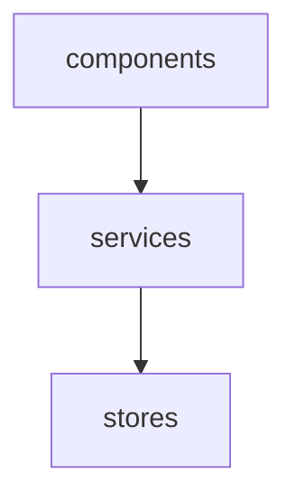
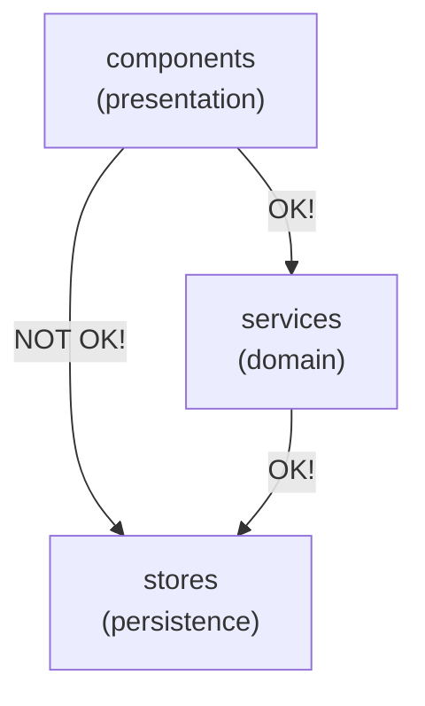
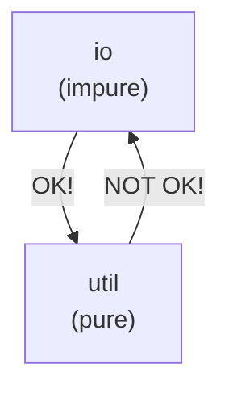
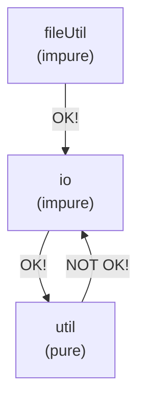
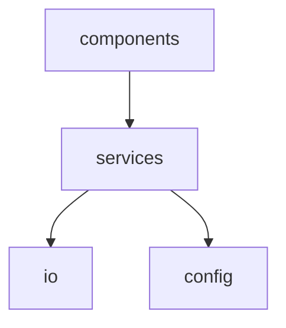
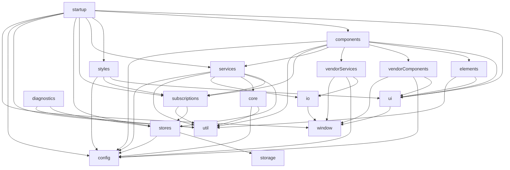

# Module Composer

A tiny but powerful closure-based module composition utility.

Why is it so common for JavaScript applications these days (backend _and_ frontend) to be organised and reasoned about in terms of scripts and files, and navigated via a convoluted maze of file imports?

Module Composer aims to encourage good modular design and intentionality for application architecture by making it easier to design and reason about applications at a higher level, in this case, as a composition of _modules_.

So what is a module? Not to be confused with JavaScript CJS or ESM modules, a module in this context is simply a plain old JavaScript object (a POJO!) with functions that accept a very explicitly defined set of _other_ modules. These functions are _higher-order_ in that they return another function whose invocation may be deferred to later in the application lifecycle, while retaining access to the provided modules thanks to the power of closures (stateful functions). Closures are a native feature of JavaScript.

If that sounds like a lot to wrap your head around, fear not! Implementation-wise it's actually rather simple. See the [basic example](#basic-example) below to see it in action.

## Table of Contents

<!-- START doctoc generated TOC please keep comment here to allow auto update -->
<!-- DON'T EDIT THIS SECTION, INSTEAD RE-RUN doctoc TO UPDATE -->
<!-- END doctoc generated TOC please keep comment here to allow auto update -->

- [Install](#install)
- [Basic example](#basic-example)
- [Composition root](#composition-root)
- [File system](#file-system)
- [Mermaid diagrams](#mermaid-diagrams)
- [Dependency injection](#dependency-injection)
- [Functional programming](#functional-programming)
- [Application configuration](#application-configuration)
- [Fitness functions](#fitness-functions)
- [Testability](#testability)
- [Ejecting](#ejecting)
- [Advanced example: Agile Avatars](#advanced-example-agile-avatars)

<!-- END doctoc generated TOC please keep comment here to allow auto update -->

## Install

```
npm install module-composer
```

## Basic example

Consider the following example:

```js
import composer from 'module-composer';
import modules from './modules';

const { compose } = composer(modules);
const { stores } = compose('stores');
const { services } = compose('services', { stores });
const { components } = compose('components', { services });
```
<p align="right"><a href="examples/basic/compose-no-export.js">View source</a></p>

`modules` is simply an object containing an entry for each module:

```js
{
    stores: { ... },
    services: { ... },
    components: { ... }
}
```

The first step is to create a `compose` function for the given _uncomposed_ modules. The `compose` function is then used to compose a module of other modules. The _composed_ module is then returned and may be used to compose another module, and so on.

Each module is simply an object containing an entry for each function of the module:

```js
export default {
    components: {
        productDetails: ({ services }) => ({ product }) => {
            // When Add to Cart button clicked...
            services.addToCart({ product, quantity: 1 });
        }
    },
    services: {
        addToCart: ({ stores }) => ({ productId, quantity }) => {
            // Use productId and quantity to produce items and totalCost...
            stores.setCart({ items, totalCost });
        }
    },
    stores: {
        setCart: () => ({ items, totalCost }) => {
            // Store items and totalCost...
        }
    }
};
```
<p align="right"><a href="examples/basic/modules.js">View source</a></p>

Notice the _double arrow_ functions? That's syntactic sugar for _a function that returns another function_.

The following are equivalent:

```js
const getPrice = ({ stores }) => ({ productId }) => {
    return stores.getProduct(productId).price;
};
```

```js
const getPrice = ({ stores }) => {
    return ({ productId }) => {
        return stores.getProduct(productId).price;
    };
};
```

The `compose` function invokes the first arrow function with the specified modules for each entry in the module and returns the second arrow function.

This is analogous to calling a class constructor with dependencies and returning the resulting instance. However rather than using a class to encapsulate dependency state, closures (stateful functions) are used instead.

## Composition root

Module Composer should be isolated to the _composition root_ of the application.

> A Composition Root is a (preferably) unique location in an application where modules are composed together.<br/>— [Mark Seeman](https://blog.ploeh.dk/2011/07/28/CompositionRoot/)

Module composition should occur as close to the entry point of the application as possible.

Here's an example of a composition root isolated to a separate file named `compose.js`: 

```js
import composer from 'module-composer';
import modules from './modules';

export default () => {
    const { compose } = composer(modules);
    const { stores } = compose('stores');
    const { services } = compose('services', { stores });
    const { components } = compose('components', { services });
    return compose;
};
```
<p align="right"><a href="examples/basic/compose.js">View source</a></p>

And here's an example of an entry point for a single-page (web) application (SPA):

```js
import compose from './compose';
const { modules } = compose();
const app = modules.components.app();
document.getElementById('app').append(app);
```
<p align="right"><a href="examples/basic/app.js">View source</a></p>

Recommended reading:

- [Composition Root](https://blog.ploeh.dk/2011/07/28/CompositionRoot/) — Mark Seemann
- [Understanding the Composition Root](https://freecontent.manning.com/dependency-injection-in-net-2nd-edition-understanding-the-composition-root/) — Steven van Deursen & Mark Seemann

## File system

Module Composer influences (but does not necessitate) the file system toward _file-per-function_.

The module hierarchy can be easily represented by the file system:

```
src/
    app.js
    compose.js
    modules/
        index.js
        stores/
            index.js
            add-to-cart.js        
        services/
            index.js
            order-product.js        
        components/
            index.js
            product-details.js
```

This hierarchy can be mirrored in code by rolling up each file in each directory using `index.js` files. This approach leads to a design where any file is only ever imported once regardless of the number of usages. It also reduces or eliminates the large blocks of import statements typically found at the top of each file, and eliminates any need for path backtracking, i.e. `../../../`. Path backtracking is a potential code smell due to the risk of inappropriate coupling. Instead, the relationships between each module are explicitly established during at application initialisation time.

```js
import components from './components';
import services from './services';
import stores from './stores';

export default {
    components,
    services,
    stores
};
```
<p align="right"><a href="examples/basic/modules/index.js">View source</a></p>

```js
import productDetails from './product-details';

export default {
    productDetails
};
```
<p align="right"><a href="examples/basic/modules/components/index.js">View source</a></p>

This pattern opens the possibility of generating `index.js` files. This means that not only is each file only ever imported once, a developer needn't write import statements at all.

The package `module-indexgen` is designed to do just that: https://github.com/mattriley/node-module-indexgen

## Mermaid diagrams

Module Composer can generate diagrams-as-code using _Mermaid_.

> Mermaid is a tool for creating diagrams and visualizations using text and code.<br/> https://mermaid-js.github.io • https://github.com/mermaid-js/mermaid

GitHub can render diagrams directly from Mermaid syntax in markdown files. See [Include diagrams in your Markdown files with Mermaid](https://github.blog/2022-02-14-include-diagrams-markdown-files-mermaid/) for more information.

Use `compose.mermaid()` to generate a Mermaid diagram:

```js
import composer from 'module-composer';
import modules from './modules';

const { compose } = composer(modules);
const { stores } = compose('stores');
const { services } = compose('services', { stores });
const { components } = compose('components', { services });

console.log(compose.mermaid);
```
<p align="right"><a href="examples/basic/compose-mermaid.js">View source</a></p>

Output:

```
graph TD;
    components-->services;
    services-->stores;
```

Which renders:


<p align="right"><em>Diagram not rendering?</em> <a href="https://github.com/mattriley/node-module-composer">View on GitHub</a></p>

_If the diagram is not rendered, you might not be viewing this file in GitHub._

For a less contrived example, see [Advanced example: Agile Avatars](#advanced-example-agile-avatars) below.

## Dependency injection

Module Composer achieves the equivalent of _dependency injection_ using closures (stateful functions).

Well known advantages of dependency injection include:

- Ability to swap implementations, e.g. repositories that integrate with different database engines.
- Ability to stub/mock/fake dependencies for testing purposes.

Dependency injection is a big (and sometimes controversial) topic and worth being familiar with.

Although Module Composer enables dependency injection, remember that the primary aim is to encourage good modular design and intentionality for application architecture.

Recommended reading:

- [Partial application is dependency injection](https://blog.ploeh.dk/2017/01/30/partial-application-is-dependency-injection/) — Mark Seemann
- [DIP in the Wild](https://martinfowler.com/articles/dipInTheWild.html) — Brett L. Schuchert on martinfowler.com
- [Inversion of Control Containers and the Dependency Injection pattern](https://martinfowler.com/articles/injection.html) — Martin Fowler
- [Dependency Injection Inversion](https://sites.google.com/site/unclebobconsultingllc/home/articles/dependency-injection-inversion) — Robert C. "Uncle Bob" Martin
- [The Dependency Inversion
Principle](https://drive.google.com/file/d/0BwhCYaYDn8EgMjdlMWIzNGUtZTQ0NC00ZjQ5LTkwYzQtZjRhMDRlNTQ3ZGMz/view)  — Robert C. "Uncle Bob" Martin

## Functional programming

Module Composer is designed with a bias toward _functional programming_.

The closure-based approach is only possible thanks to JavaScript support for functions as first-class objects. That's not to suggest JavaScript or Module Composer are necessarily functional, but preferencing functions over classes (for instance) may encourage a more functional design. It's entirely possible, and arguably desirable to design JavaScript applications without classes!

An important consideration in functional design is the segregation of pure and impure functions. When designing modules, be intentional about purity and impurity.

> One very important characteristic of impurity is that it’s inherently contagious. Any function that depends on the execution of an impure function becomes impure as well.<br/>—[Oleksii Holub](https://tyrrrz.me/blog/pure-impure-segregation-principle)

See [Fitness functions](#fitness-functions) below to learn how Module Composer can help maintain pure-impure segregation.

Recommended reading:

- [Pure-Impure Segregation Principle](https://tyrrrz.me/blog/pure-impure-segregation-principle) — Oleksii Holub

## Application configuration

For convenience, config can be passed as an option to the composer function. If `configs` is an array, they will be merged using [Lodash merge](https://lodash.com/docs#merge) and returned along with the compose function.

In the next example, `defaultConfig`, `testConfig` and `userConfig` are merged to produce `config`, which is then passed as a dependency of the `components` module.

```js
const { compose, config } = composer(modules, { configs: [defaultConfig, testConfig, userConfig] });
const { components } = compose('components', { config });
```

This can be especially useful during testing by applying test config.

## Fitness functions

Module Composer can describe the dependency graph to enable _fitness functions_ on coupling.

> An architectural fitness function, as defined in Building Evolutionary Architectures, provides an objective integrity assessment of some architectural characteristics, which may encompass existing verification criteria, such as unit testing, metrics, monitors, and so on.<br/>— [Thoughtworks](https://www.thoughtworks.com/en-au/radar/techniques/architectural-fitness-function)

Inappropriate coupling leads to brittle designs that can be difficult to reason about, difficult to change and difficult to test.

Use `compose.dependencies` to obtain a dependency graph similar to:

```js
{
    components: ['services'],
    services: ['stores'],
    stores: []
}
```

The examples below leverage `compose.dependencies` to demonstrate fitness function in the form of unit tests.

### Example 1: N-tier architecture

Assuming an _n-tier_ architecture, where the `components` module resides in the _presentation_ layer, `services` in the _domain_ layer, and `stores` in the _persistence_ layer, it could be tempting to couple `components` to `stores`,  inadvertently bypassing the domain layer.



The following fitness function asserts that `components` is not coupled to `stores`. 

```js
test('components is not coupled to stores in order to maintain layering', t => {
    const { dependencies } = compose();
    t.notOk(dependencies['components'].includes('stores'));
});
```

### Example 2: Pure-impure segregation

`util` is a module of _pure_ utility functions, and `io` is module is _impure_ io operations. It could be tempting to extend `util` with say file utilities that depend on `io`, however doing so would make `util` impure.



The following fitness function asserts that `util` is not coupled to `io`.

```js
test('util is not coupled to io in order to maintain purity', t => {
    const { dependencies } = compose();
    t.notOk(dependencies['util'].includes('io'));
});
```

The solution introducing file utilities whilst maintaining purity would be to introduce a new module, say `fileUtil`:



## Testability

Module Composer encourages reasoning about _modules_ instead of _files_ and this principle also extends to testing.

A common practice in unit testing, is to stub/mock/fake dependencies, especially those dependencies that are not deterministic, or cause _side-effects_, i.e. interact with databases or other external services. 

In JavaScript, this is commonly achieved using a tool that intercepts the file imports of the dependendenies of the file under test. Digest that for a moment. Why on Earth should our test need to know and be coupled to the physical storage location of a unit's dependencies? No wonder these tests are so brittle.

Here's how mocking is typically achieved with Jest:

TODO: Insert Jest mock example

Module Composer provides an `overrides` option to override any part of the dependency graph:

TODO: Insert overrides example

## Ejecting

Module Composer can be _ejected_ by generating the equivalent vanilla JavaScript code. Well, that's the vision anyway! The current implementation has some limitations. Please raise an issue if you'd like to see this developed further.

Take the composition root of the Gravatar SPA example:

```js
import composer from 'module-composer';
import modules from './modules';
import defaultConfig from './default-config';

export default ({ overrides } = {}) => {

    const { compose, config } = composer(modules, { overrides, defaultConfig });
    const io = { fetch: (...args) => window.fetch(...args) };
    const { services } = compose('services', { io, config });
    compose('components', { services });
    return compose;

};
```
<p align="right"><a href="examples/gravatar-spa/src/compose.js">View source</a></p>

Mermaid digram:


<p align="right"><em>Diagram not rendering?</em> <a href="https://github.com/mattriley/node-module-composer">View on GitHub</a></p>

Use `compose.eject()` to generate the equivalent vanilla JavaScript code:

```js
(modules, { io, config }) => {

    const services = { ...modules.services };
    const servicesDependencies = { services, io, config };
    services.fetchContact = services.fetchContact({ ...servicesDependencies });
    services.fetchGravatarProfile = services.fetchGravatarProfile({ ...servicesDependencies });

    const components = { ...modules.components };
    const componentsDependencies = { components, services };
    components.app = components.app({ ...componentsDependencies });
    components.contactForm = components.contactForm({ ...componentsDependencies });
    components.contactView = components.contactView({ ...componentsDependencies });

    return { ...modules, services, components };

};
```

## Advanced example: Agile Avatars

> Great looking avatars for your agile board and experiment in FRAMEWORK-LESS, vanilla JavaScript.<br/>
https://agileavatars.com • https://github.com/mattriley/agileavatars

Module composition:

```js
import composer from 'module-composer';
import modules from './modules';
import defaultConfig from './default-config';
const { storage, util } = modules;

export default ({ window, overrides, configs }) => {

    const { compose, config } = composer(modules, { overrides, defaultConfig, configs });

    // Data
    const { stores } = compose('stores', { storage, config });
    const { subscriptions } = compose('subscriptions', { stores, util });

    // Domain
    const { core } = compose('core', { util, config });
    const { io } = compose('io', { window });
    const { services } = compose('services', { subscriptions, stores, core, io, util, config });
    const { vendorServices } = compose('vendorServices', { io, config, window });

    // Presentation
    const { ui } = compose('ui', { window });
    const { elements } = compose('elements', { ui, util });
    const { vendorComponents } = compose('vendorComponents', { ui, config, window });
    const { components } = compose('components', { ui, elements, vendorComponents, vendorServices, services, subscriptions, util, config });
    const { styles } = compose('styles', { ui, subscriptions, config });

    // Startup    
    compose('diagnostics', { stores, util });
    compose('startup', { ui, components, styles, services, subscriptions, stores, util, config, window });

    return compose;

};
```

Mermaid digram:


<p align="right"><em>Diagram not rendering?</em> <a href="https://github.com/mattriley/node-module-composer">View on GitHub</a></p>

Ejected output:

```js
(modules, { config, window }) => {

    const stores = { ...modules.stores };
    const storesDependencies = { stores, storage, config };
    stores.setup = stores.setup({ ...storesDependencies });

    const subscriptions = { ...modules.subscriptions };
    const subscriptionsDependencies = { subscriptions, stores, util };
    subscriptions.setup = subscriptions.setup({ ...subscriptionsDependencies });

    const core = { ...modules.core };
    const coreDependencies = { core, util, config };
    core.gravatar.buildImageUrl = core.gravatar.buildImageUrl({ ...coreDependencies });
    core.gravatar.buildProfileUrl = core.gravatar.buildProfileUrl({ ...coreDependencies });
    core.gravatar.getNameFromProfile = core.gravatar.getNameFromProfile({ ...coreDependencies });
    core.gravatar.hashEmail = core.gravatar.hashEmail({ ...coreDependencies });
    core.roles.assignColor = core.roles.assignColor({ ...coreDependencies });
    core.roles.buildRole = core.roles.buildRole({ ...coreDependencies });
    core.roles.randomColor = core.roles.randomColor({ ...coreDependencies });
    core.tags.buildTag = core.tags.buildTag({ ...coreDependencies });
    core.tags.parseEmailExpression = core.tags.parseEmailExpression({ ...coreDependencies });
    core.tags.parseFileExpression = core.tags.parseFileExpression({ ...coreDependencies });
    core.tags.parseTagExpression = core.tags.parseTagExpression({ ...coreDependencies });
    core.tags.planTagInstanceAdjustment = core.tags.planTagInstanceAdjustment({ ...coreDependencies });
    core.tags.sortTagInstancesByTagThenMode = core.tags.sortTagInstancesByTagThenMode({ ...coreDependencies });
    core.tags.sortTagsByName = core.tags.sortTagsByName({ ...coreDependencies });
    core.tags.sortTagsByRoleThenName = core.tags.sortTagsByRoleThenName({ ...coreDependencies });

    const io = { ...modules.io };
    const ioDependencies = { io, window };
    io.setup = io.setup({ ...ioDependencies });

    const services = { ...modules.services };
    const servicesDependencies = { services, subscriptions, stores, core, io, util, config };
    services.gravatar.changeFallback = services.gravatar.changeFallback({ ...servicesDependencies });
    services.gravatar.changeFreetext = services.gravatar.changeFreetext({ ...servicesDependencies });
    services.gravatar.fetchImageAsync = services.gravatar.fetchImageAsync({ ...servicesDependencies });
    services.gravatar.fetchProfileAsync = services.gravatar.fetchProfileAsync({ ...servicesDependencies });
    services.gravatar.status = services.gravatar.status({ ...servicesDependencies });
    services.roles.changeRoleColor = services.roles.changeRoleColor({ ...servicesDependencies });
    services.roles.changeRoleName = services.roles.changeRoleName({ ...servicesDependencies });
    services.roles.findOrInsertRoleWithName = services.roles.findOrInsertRoleWithName({ ...servicesDependencies });
    services.roles.getNilRoleId = services.roles.getNilRoleId({ ...servicesDependencies });
    services.roles.getRole = services.roles.getRole({ ...servicesDependencies });
    services.roles.insertRole = services.roles.insertRole({ ...servicesDependencies });
    services.roles.isNilRole = services.roles.isNilRole({ ...servicesDependencies });
    services.roles.setupRolePropagation = services.roles.setupRolePropagation({ ...servicesDependencies });
    services.settings.changeModal = services.settings.changeModal({ ...servicesDependencies });
    services.settings.changeOption = services.settings.changeOption({ ...servicesDependencies });
    services.settings.clearModal = services.settings.clearModal({ ...servicesDependencies });
    services.settings.getGravatar = services.settings.getGravatar({ ...servicesDependencies });
    services.tags.adjustTagInstanceCounts = services.tags.adjustTagInstanceCounts({ ...servicesDependencies });
    services.tags.attachImageAsync = services.tags.attachImageAsync({ ...servicesDependencies });
    services.tags.buildTagInstance = services.tags.buildTagInstance({ ...servicesDependencies });
    services.tags.changeTagName = services.tags.changeTagName({ ...servicesDependencies });
    services.tags.changeTagRole = services.tags.changeTagRole({ ...servicesDependencies });
    services.tags.getTagInstance = services.tags.getTagInstance({ ...servicesDependencies });
    services.tags.insertFileAsync = services.tags.insertFileAsync({ ...servicesDependencies });
    services.tags.insertFileBatchAsync = services.tags.insertFileBatchAsync({ ...servicesDependencies });
    services.tags.insertGravatarAsync = services.tags.insertGravatarAsync({ ...servicesDependencies });
    services.tags.insertGravatarBatchAsync = services.tags.insertGravatarBatchAsync({ ...servicesDependencies });
    services.tags.insertTag = services.tags.insertTag({ ...servicesDependencies });
    services.tags.insertTagInstance = services.tags.insertTagInstance({ ...servicesDependencies });
    services.tags.removeTagInstance = services.tags.removeTagInstance({ ...servicesDependencies });
    services.tags.setupRolePropagation = services.tags.setupRolePropagation({ ...servicesDependencies });
    services.tags.setupTagPropagation = services.tags.setupTagPropagation({ ...servicesDependencies });
    services.tags.sortTagInstances = services.tags.sortTagInstances({ ...servicesDependencies });

    const vendorServices = { ...modules.vendorServices };
    const vendorServicesDependencies = { vendorServices, io, config, window };
    vendorServices.gtag = vendorServices.gtag({ ...vendorServicesDependencies });
    vendorServices.sentry = vendorServices.sentry({ ...vendorServicesDependencies });

    const ui = { ...modules.ui };
    const uiDependencies = { ui, window };
    ui.appendToHead = ui.appendToHead({ ...uiDependencies });
    ui.el = ui.el({ ...uiDependencies });
    ui.event = ui.event({ ...uiDependencies });
    ui.refocus = ui.refocus({ ...uiDependencies });
    ui.toggleBoolClass = ui.toggleBoolClass({ ...uiDependencies });

    const elements = { ...modules.elements };
    const elementsDependencies = { elements, ui, util };
    elements.dropzone = elements.dropzone({ ...elementsDependencies });
    elements.editableSpan = elements.editableSpan({ ...elementsDependencies });
    elements.label = elements.label({ ...elementsDependencies });
    elements.layout = elements.layout({ ...elementsDependencies });
    elements.modal = elements.modal({ ...elementsDependencies });
    elements.number = elements.number({ ...elementsDependencies });

    const vendorComponents = { ...modules.vendorComponents };
    const vendorComponentsDependencies = { vendorComponents, ui, config, window };
    vendorComponents.gtagScript = vendorComponents.gtagScript({ ...vendorComponentsDependencies });
    vendorComponents.vanillaPicker = vendorComponents.vanillaPicker({ ...vendorComponentsDependencies });

    const components = { ...modules.components };
    const componentsDependencies = { components, ui, elements, vendorComponents, vendorServices, services, subscriptions, util, config };
    components.app = components.app({ ...componentsDependencies });
    components.dropzone = components.dropzone({ ...componentsDependencies });
    components.gravatar.actions.container = components.gravatar.actions.container({ ...componentsDependencies });
    components.gravatar.actions.error = components.gravatar.actions.error({ ...componentsDependencies });
    components.gravatar.actions.importButton = components.gravatar.actions.importButton({ ...componentsDependencies });
    components.gravatar.actions.loading = components.gravatar.actions.loading({ ...componentsDependencies });
    components.gravatar.content.container = components.gravatar.content.container({ ...componentsDependencies });
    components.gravatar.content.fallback = components.gravatar.content.fallback({ ...componentsDependencies });
    components.gravatar.content.fallbacks = components.gravatar.content.fallbacks({ ...componentsDependencies });
    components.gravatar.content.freetext = components.gravatar.content.freetext({ ...componentsDependencies });
    components.gravatar.title = components.gravatar.title({ ...componentsDependencies });
    components.header.container = components.header.container({ ...componentsDependencies });
    components.header.titleBar = components.header.titleBar({ ...componentsDependencies });
    components.imageUploadOptions.chooseImages = components.imageUploadOptions.chooseImages({ ...componentsDependencies });
    components.imageUploadOptions.container = components.imageUploadOptions.container({ ...componentsDependencies });
    components.imageUploadOptions.gravatar = components.imageUploadOptions.gravatar({ ...componentsDependencies });
    components.modal = components.modal({ ...componentsDependencies });
    components.modals.gravatar = components.modals.gravatar({ ...componentsDependencies });
    components.modals.tips = components.modals.tips({ ...componentsDependencies });
    components.modals.welcome = components.modals.welcome({ ...componentsDependencies });
    components.optionsBar.container = components.optionsBar.container({ ...componentsDependencies });
    components.optionsBar.numberOption = components.optionsBar.numberOption({ ...componentsDependencies });
    components.optionsBar.options.modes = components.optionsBar.options.modes({ ...componentsDependencies });
    components.optionsBar.options.outline = components.optionsBar.options.outline({ ...componentsDependencies });
    components.optionsBar.options.shapes = components.optionsBar.options.shapes({ ...componentsDependencies });
    components.optionsBar.options.size = components.optionsBar.options.size({ ...componentsDependencies });
    components.optionsBar.options.sort = components.optionsBar.options.sort({ ...componentsDependencies });
    components.optionsBar.options.spacing = components.optionsBar.options.spacing({ ...componentsDependencies });
    components.optionsBar.shapeOption = components.optionsBar.shapeOption({ ...componentsDependencies });
    components.roleList.container = components.roleList.container({ ...componentsDependencies });
    components.roleList.roleCustomiser.container = components.roleList.roleCustomiser.container({ ...componentsDependencies });
    components.roleList.roleCustomiser.masterRoleName = components.roleList.roleCustomiser.masterRoleName({ ...componentsDependencies });
    components.roleList.roleCustomiser.roleColorPicker = components.roleList.roleCustomiser.roleColorPicker({ ...componentsDependencies });
    components.tagList.container = components.tagList.container({ ...componentsDependencies });
    components.tagList.tag.components.roleName = components.tagList.tag.components.roleName({ ...componentsDependencies });
    components.tagList.tag.components.tagImage = components.tagList.tag.components.tagImage({ ...componentsDependencies });
    components.tagList.tag.components.tagName = components.tagList.tag.components.tagName({ ...componentsDependencies });
    components.tagList.tag.container = components.tagList.tag.container({ ...componentsDependencies });
    components.tips.badges = components.tips.badges({ ...componentsDependencies });
    components.tips.images = components.tips.images({ ...componentsDependencies });
    components.tips.laminating = components.tips.laminating({ ...componentsDependencies });
    components.tips.multiples = components.tips.multiples({ ...componentsDependencies });
    components.tips.naming = components.tips.naming({ ...componentsDependencies });
    components.tips.roleShortcut = components.tips.roleShortcut({ ...componentsDependencies });

    const styles = { ...modules.styles };
    const stylesDependencies = { styles, ui, subscriptions, config };
    styles.roleColor = styles.roleColor({ ...stylesDependencies });
    styles.tagImage = styles.tagImage({ ...stylesDependencies });
    styles.tagOutline = styles.tagOutline({ ...stylesDependencies });
    styles.tagShape = styles.tagShape({ ...stylesDependencies });
    styles.tagSize = styles.tagSize({ ...stylesDependencies });
    styles.tagSpacing = styles.tagSpacing({ ...stylesDependencies });
    styles.vanillaPicker = styles.vanillaPicker({ ...stylesDependencies });

    const diagnostics = { ...modules.diagnostics };
    const diagnosticsDependencies = { diagnostics, stores, util };
    diagnostics.dumpState = diagnostics.dumpState({ ...diagnosticsDependencies });

    const startup = { ...modules.startup };
    const startupDependencies = { startup, ui, components, styles, services, subscriptions, stores, util, config, window };
    startup.createHandlers = startup.createHandlers({ ...startupDependencies });
    startup.createStyleManager = startup.createStyleManager({ ...startupDependencies });
    startup.insertNilRole = startup.insertNilRole({ ...startupDependencies });
    startup.start = startup.start({ ...startupDependencies });

    return { ...modules, stores, subscriptions, core, io, services, vendorServices, ui, elements, vendorComponents, components, styles, diagnostics, startup };

};
```
