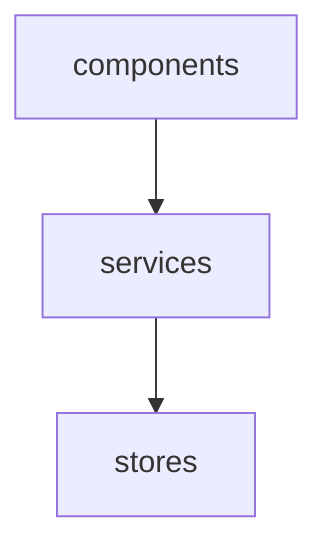
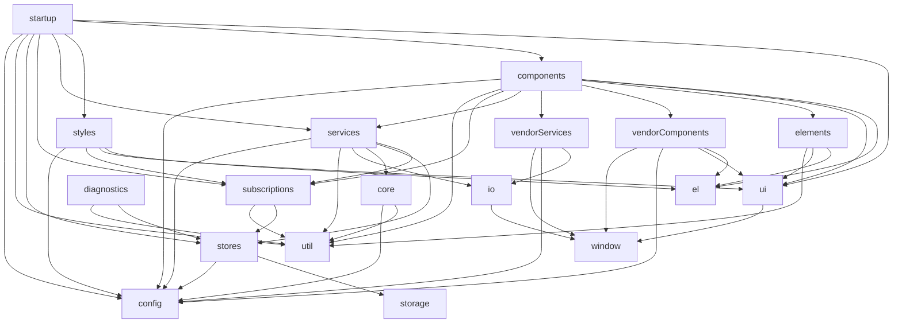

# Module Composer

A tiny but powerful closure-based module composition utility.

Why is it so common for JavaScript applications these days (backend _and_ frontend) to be organised and reasoned about in terms of scripts and files, and navigated via a convoluted maze of file imports?

Module Composer aims to encourage good modular design and intentionality for application architecture by making it easier to design and reason about applications at a higher level, in this case, as a composition of _modules_.

So what is a module? Not to be confused with JavaScript CJS or ESM modules, a module in this context is simply a plain old JavaScript object (a POJO!) with functions that accept a very explicitly defined set of _other_ modules. These functions are _higher-order_ in that they return another function whose invocation may be deferred to later in the application lifecycle, while retaining access to the provided modules thanks to the power of closures (stateful functions). Closures are a native feature of JavaScript.

If that sounds like a lot to wrap your head around, fear not! Implementation-wise it's actually rather simple. See the [basic example](#basic-example) below to see it in action.

## Table of Contents

<!-- START doctoc generated TOC please keep comment here to allow auto update -->
<!-- DON'T EDIT THIS SECTION, INSTEAD RE-RUN doctoc TO UPDATE -->
<!-- END doctoc generated TOC please keep comment here to allow auto update -->

- [Install](#install)
- [Basic example](#basic-example)
- [File system structure](#file-system-structure)
- [Mermaid diagrams](#mermaid-diagrams)
- [App config](#app-config)
- [Inversion of Control (IoC)](#inversion-of-control-ioc)
- [Advanced example: Agile Avatars](#advanced-example-agile-avatars)

<!-- END doctoc generated TOC please keep comment here to allow auto update -->

## Install

```
npm install module-composer
```

## Basic example

Consider the following example:

```js
import composer from 'module-composer';
import modules from './modules';

const { compose } = composer(modules);
const { stores } = compose('stores');
const { services } = compose('services', { stores });
const { components } = compose('components', { services });
```

`modules` is simply an object containing an entry for each module:

```js
{
    stores: { ... },
    services: { ... },
    components: { ... }
}
```

The first step is to create a `compose` function for the given _uncomposed_ modules. The `compose` function is then used to compose a module of other modules. The _composed_ module is then returned and may be used to compose another module, and so on.

Each module is simply an object containing an entry for each function of the module:

```js
export default {
    components: {
        productDetails: ({ services }) => ({ product }) => {
            // When Add to Cart button clicked...
            services.addToCart({ product, quantity: 1 });
        }
    },
    services: {
        addToCart: ({ stores }) => ({ productId, quantity }) => {
            // Use productId and quantity to produce items and totalCost...
            stores.setCart({ items, totalCost });
        }
    },
    stores: {
        setCart: () => ({ items, totalCost }) => {
            // Store items and totalCost...
        }
    }
};
```

Notice the _double arrow_ functions? That's syntactic sugar for _a function that returns another function_.

Here's the equivalent _without_ double arrows, using `components` as an example:

```js
export default {
    components: {
        productDetails: ({ services }) => {
            return ({ product }) => { ... }
        }
    }
}
```

The `compose` function invokes the first arrow function with the specified modules for each entry in the module and returns the second arrow function.

This is analogous to calling a class constructor with dependencies and returning the resulting instance. However rather than using a class to encapsulate dependency state, closures (stateful functions) are used instead.

## File system structure

The module hierarchy can be easily represented by the file system:

```
modules/
    index.js
    stores/
        index.js
        addToCart.js        
    services/
        index.js
        orderProduct.js        
    components/
        index.js
        productDetails.js        
```

This hierarchy can be mirrored in code by rolling up each file in each directory using `index.js` files. This approach leads to a design where any file is only ever imported once regardless of the number of usages. It also reduces or eliminates the large blocks of import statements typically found at the top of each file, and eliminates any need for path backtracking, i.e. `../../../`. Path backtracking is a potential code smell due to the risk of inappropriate coupling. Instead, the relationships between each module are explicitly established during at application initialisation time.

```js
import components from './components';
import services from './services';
import stores from './stores';

export default {
    components,
    services,
    stores
};
```

```js
import productDetails from './product-details';

export default {
    productDetails
};
```

This pattern opens the possibility of generating `index.js` files. This means that not only is each file only ever imported once, a developer needn't write import statements at all.

The package `module-indexgen` is designed to do just that: https://github.com/mattriley/node-module-indexgen

## Mermaid diagrams

[Mermaid](https://mermaid-js.github.io) is a tool for creating diagrams and visualizations using text and code. 

Since early 2022, GitHub can render diagrams directly from Mermaid syntax in markdown files. See [Include diagrams in your Markdown files with Mermaid](https://github.blog/2022-02-14-include-diagrams-markdown-files-mermaid/) for more information.

Module Composer provides a `mermaid` function to generate a Mermaid diagram as code:

```js
import composer from 'module-composer';
import modules from './modules';

const { compose, mermaid } = composer(modules);
const { stores } = compose('stores');
const { services } = compose('services', { stores });
const { components } = compose('components', { services });

const diagram = mermaid();
```

The value of `diagram` is:

```
graph TD;
    components-->services;
    services-->stores;
```

Which renders:



_If the diagram is not rendered, you might not be viewing this file in GitHub._

For a less contrived example, see [Advanced example: Agile Avatars](#advanced-example-agile-avatars) below.

## App config

For convenience, config can be passed as the second and subsequent parameters to the composer function. These configs are merged using [Lodash merge](https://www.npmjs.com/package/lodash.merge) and returned along with the compose function.

In the next example, `defaultConfig` and `userConfig` are merged to produce `config`, which is then passed as a dependency of the `components` module.

```js
const { compose, config } = composer(modules, defaultConfig, userConfig);
const { components } = compose('components', { config });
```

This can be especially useful during testing by applying test config.

## Inversion of Control (IoC)

Module Composer enables Inversion of Control by externalising _other modules_ as dependencies. 

Well known advantages of Inversion of Control include:

- The ability to switch implementations at runtime, e.g. repositories that integrate with different database technologies.
- The ability to stub/mock/fake dependencies for testing purposes.

Inversion of Control is a big (and sometimes controversial) topic and worth being familiar with.

I want to stress that although Module Composer enables Inversion of Control, the primary aim is to encourage good modular design and intentionality for application architecture.

## Advanced example: Agile Avatars

> Great looking avatars for your agile board and experiment in FRAMEWORK-LESS, vanilla JavaScript.<br/>
https://agileavatars.com • https://github.com/mattriley/agileavatars

Module composition:

```js
import composer from 'module-composer';
import modules from './modules';
import defaultConfig from './default-config';
const { storage, util } = modules;

export default ({ window, configs }) => {

    const { compose, config } = composer(modules, defaultConfig, configs);

    // Data
    const { stores } = compose('stores', { storage, config });
    const { subscriptions } = compose('subscriptions', { stores, util });

    // Domain
    const { core } = compose('core', { util, config });
    const { io } = compose('io', { window });
    const { services } = compose('services', { subscriptions, stores, core, io, util, config });
    const { vendorServices } = compose('vendorServices', { io, config, window });

    // Presentation
    const { ui } = compose('ui', { window });
    const { el } = ui;
    const { elements } = compose('elements', { el, ui, util });
    const { vendorComponents } = compose('vendorComponents', { el, ui, config, window });
    const { components } = compose('components', { el, ui, elements, vendorComponents, vendorServices, services, subscriptions, util, config });
    const { styles } = compose('styles', { el, ui, subscriptions, config });

    // Startup    
    compose('diagnostics', { stores, util });
    return compose('startup', { ui, components, styles, services, subscriptions, stores, util, config });

};
```

Mermaid digram:


