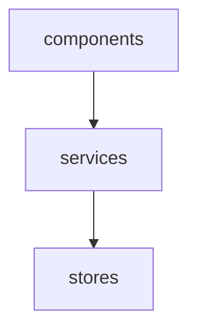
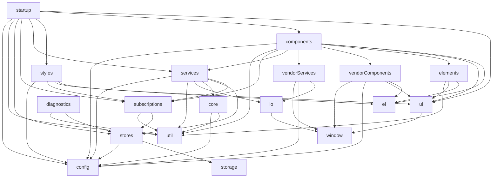

# Module Composer

A tiny but powerful closure-based module composition utility.

## Table of Contents

<!-- START doctoc generated TOC please keep comment here to allow auto update -->
<!-- DON'T EDIT THIS SECTION, INSTEAD RE-RUN doctoc TO UPDATE -->
<!-- END doctoc generated TOC please keep comment here to allow auto update -->

- [Install](#install)
- [Basic example](#basic-example)
- [File system structure](#file-system-structure)
- [Generating Mermaid diagrams](#generating-mermaid-diagrams)
- [Advanced example: Agile Avatars](#advanced-example-agile-avatars)

<!-- END doctoc generated TOC please keep comment here to allow auto update -->

## Install

```
npm install module-composer
```

## Basic example

Consider the following example:

<details open>
<summary>./examples/basic/compose.js</summary>

```js
import composer from 'module-composer';
import modules from './modules';

export default () => {
    const { compose } = composer(modules);
    const { stores } = compose('stores');
    const { services } = compose('services', { stores });
    const { components } = compose('components', { services });
    return compose.getModules();
};
```
</details>

`modules` is simply an object containing an entry for each module:

```js
{
    stores: { ... },
    services: { ... },
    components: { ... }
}
```

`composer` is passed `modules` and returns a `compose` function.

`compose` is then passed dependencies for a given module name and returns the "composed" module.

Each module is simply an object containing an entry for each module function:

<details open>
<summary>./examples/basic/modules.js</summary>

```js
export default {
    components: {
        productDetails: ({ services }) => ({ product }) => {
            // When Add to Cart button clicked...
            services.addToCart({ product, quantity: 1 });
        }
    },
    services: {
        addToCart: ({ stores }) => ({ productId, quantity }) => {
            // Use productId and quantity to produce items and totalCost...
            stores.setCart({ items, totalCost });
        }
    },
    stores: {
        setCart: () => ({ items, totalCost }) => {
            // Store items and totalCost...
        }
    }
};
```
</details>

Notice the "double arrow" functions? That's syntactic sugar for "a function at returns another function".

Here's the equivalent _without_ double arrows, using `components` as an example:

```js
export default {
    components: {
        productDetails: ({ services }) => {
            return ({ product }) => { ... }
        }
    }
}
```

`compose` calls the first arrow function with the specified dependencies for each entry in the module and returns the second arrow function.

This is analogous to calling a class constructor with dependencies and returning the resulting instance. However rather than using a class to encapsulate dependency state, closures (stateful functions) are used instead.

## File system structure

The module hierarchy can be easily represented by the file system:

```js
modules/
    index.js
    stores/
        index.js
        addToCart.js        
    services/
        index.js
        orderProduct.js        
    components/
        index.js
        productDetails.js        
```

`index.js` files can be used as "barrel" files to rollup each file in a directory:

<details open>
<summary>./examples/basic/modules/index.js</summary>

```js
import components from './components';
import services from './services';
import stores from './stores';

export default {
    components,
    services,
    stores
};
```
</details>

<details open>
<summary>./examples/basic/modules/components/index.js</summary>

```js
import productDetails from './product-details';

export default {
    productDetails
};
```
</details>

This pattern opens the possibility of autogenerating `index.js` files.

`module-indexgen` is a package designed to do just that: https://github.com/mattriley/node-module-indexgen

## Generating Mermaid diagrams

[Mermaid](https://mermaid-js.github.io) is a tool for creating diagrams and visualizations using text and code. Since early 2022, GitHub can render diagrams directly from Mermaid syntax in markdown files. See [Include diagrams in your Markdown files with Mermaid](https://github.blog/2022-02-14-include-diagrams-markdown-files-mermaid/) for more information.

This diagram is generated from the basic example above:



module-composer produces a module named `composition` which can be used to generate Mermaid syntax.

A consumer might generate Mermaid syntax like so:

```js
const { composition } = compose();
const graph = composition.mermaid();
```

## Advanced example: Agile Avatars

> Great looking avatars for your agile board and experiment in FRAMEWORK-LESS, vanilla JavaScript.<br/>
https://agileavatars.com • https://github.com/mattriley/agileavatars

Module composition:

<details open>
<summary>./src/compose.js</summary>

```js
import composer from 'module-composer';
import modules from './modules';
import defaultConfig from './default-config';
const { storage, util } = modules;

export default ({ window, configs }) => {

    const { compose, config } = composer({ window, ...modules }, defaultConfig, configs);

    // Data
    const { stores } = compose('stores', { storage, config });
    const { subscriptions } = compose('subscriptions', { stores, util });

    // Domain
    const { core } = compose('core', { util, config });
    const { io } = compose('io', { window });
    const { services } = compose('services', { subscriptions, stores, core, io, util, config });
    const { vendorServices } = compose('vendorServices', { io, config, window });

    // Presentation
    const { ui } = compose('ui', { window });
    const { el } = ui;
    const { elements } = compose('elements', { el, ui, util });
    const { vendorComponents } = compose('vendorComponents', { el, ui, config, window });
    const { components } = compose('components', { el, ui, elements, vendorComponents, vendorServices, services, subscriptions, util, config });
    const { styles } = compose('styles', { el, ui, subscriptions, config });

    // Startup    
    compose('diagnostics', { stores, util });
    return compose('startup', { ui, components, styles, services, subscriptions, stores, util, config });

};
```
</details>

Generated Mermaid digram:


